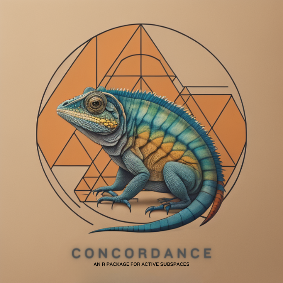

[](https://www.gnu.org/licenses/gpl-3.0)
`r badger::badge_devel("knrumsey/concordance", "purple")`


<!-- README.md is generated from README.Rmd. Please edit that file -->

```{r, echo = FALSE}
knitr::opts_chunk$set(
  collapse = TRUE,
  comment = "#>",
  fig.path = "README-"
)
library(BASS)
```

```{r, eval=TRUE, echo=FALSE, fig.cap="This logo was designed by Imagine AI Art Studio", out.width='40%'}

```


### Description 

`concordance` is an R package for performing concordance analyses and for the [discovery of active subspaces in high-dimensions](https://arxiv.org/pdf/2307.11241.pdf). The "workhorse" of the package is the `C_bass()` function, which estimates *Constantine's* $C$ matrix for a given computer model and behaves similarly to the `activegp::C_gp()` function (described in @wycoff2021sequential). The `C_bass()` function, which relies on a Bayesian MARS emulator (as described in @francom2020bass and implemented in the [BASS package](https://CRAN.R-project.org/package=BASS)) is likely to be more efficient and accurate when the dimension of the input space is large and admits a large class of *measures* for the inputs. 

To install this package, use

```{R, eval=F}
# install.packages("remotes")
remotes::install_github("knrumsey/concordance@main")
```


This R package is based on the method described [here](https://arxiv.org/pdf/2307.11241.pdf). A vignette for this package is also available and can be viewed by typing `browseVignettes("concordance")` in R (after installation). 

## Copyright Notice
&copy; *2023. Triad National Security, LLC. All rights reserved.*

*This program was produced under U.S. Government contract 89233218CNA000001 for Los Alamos
National Laboratory (LANL), which is operated by Triad National Security, LLC for the U.S.
Department of Energy/National Nuclear Security Administration. All rights in the program are
reserved by Triad National Security, LLC, and the U.S. Department of Energy/National Nuclear
Security Administration. The Government is granted for itself and others acting on its behalf a
nonexclusive, paid-up, irrevocable worldwide license in this material to reproduce, prepare
derivative works, distribute copies to the public, perform publicly and display publicly, and to permit
others to do so.*


## References


